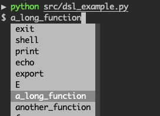

# Shell

A tool to generate a [Domain-specific Language](https://en.wikipedia.org/wiki/Domain-specific_language) (DSL).  It can be used as a command line program or interactively as a subshell/repl.

**Table of Contents**

- [Overview](#Overview)
- [Modules](#Modules)
- [Usage](#Usage)
- [Usage Examples](#Usage%20Examples)



## Overview

Main features

- A CLI. Provide an interface to user-defined commands.
- A file-browser. Query both static datastructures and APIs.
- An automation tool. Pass user-defined commands to other programs, such as Bash functions.

See [reference](SHELL_REFERENCE.md).

### FileSystem Commands

See `examples/filesystem.py` and `examples/discoverable.py`.

| Example             | Description                                                  |
| ------------------- | ------------------------------------------------------------ |
| `ls [PATH]`         | List the items in a directory. Use the current working directory by default. Alias: `list` |
| `cd`, `use [PATH]`  | Change the current working directory. Alias: `use`           |
| `get NAME`          | Retrieve a file.                                             |
| `set NAME VALUE`    | Modify a file.                                               |
| `new NAME [NAME..]` | Create new directories.                                      |
| `show [NAME]`       | Display detailed information about a directory.              |
| `cp`, `mv`, `rm`    | Modify files. I.e. copy, move, rename or remove files.       |
| `home [PATH]`       | Set home directory.                                          |
| `reset`             | Refresh cached values.                                       |

## Modules

```sh
# in src
examples/ # examples written in Python
lib/ # shell scripts
    math.sh # elementary mathematical functions
mash/ # implementation written in Python 
  .. # see below
```

```sh
# in src/mash
shell/
    base.BaseShell # A bare-bone Shell. It is a subclass of Cmd that overrides some methods.
    shell.Shell # A functional extension of BaseShell.
    function.ShellFunction # A wrapper for "normal" Python functions that includes error handling.
    delimiters # constants that are used as delimiters and operators

filesystem/
    filesystem.FileSystem # A file system simulation that provides an interface to data.
    discoverable.py # A subclass that extends Directory with lazy data loading.
    view.View # A datastructure that provides a view of internal data.
  
examples/ # Usage examples
  filesystem.py # An example with a directory-like repository
  discoverable.py
  discoverable_api.py
  shell_example.py

cli.py # A CLI that combines Shell with quo.Prompt
subhsell.py # A shell that runs in a dedicated OS process
```

## Setup

A client just has to define a mapping between commands and functions. The corresponding documentation is automatically generated from the docstrings and type annotations.

E.g.

```py
from shell import set_functions

# the mapping from command names to Python functions
functions = {'run': some_function}

# link the mapping
set_functions(functions)
```

Then a client can call for example:

```sh
./src/shell_example.py run $args 
```

## Usage

```sh
usage: shell.py [-hvsr][-f FILE] [--session SESSION] [cmd [cmd ...]]

If no positional arguments are given then an interactive subshell is started.

positional arguments:
  cmd                   A comma- or newline-separated list of commands

optional arguments:
  -h, --help            show this help message and exit
  -v, --verbose
  -s, --safe            Safe-mode. Ask for confirmation before executing commands.
  -f FILE, --file FILE  Read and run FILE as a commands
  -r, --reload          Reload last session
  --session SESSION     Use session SESSION
```

See [reference](SHELL_REFERENCE.md).

## Usage Examples

### Example 1

See `src/shell_example.py`. It shows how to use a user-definnable mapping of custom functions.
It uses the library `quo` to create a user-friendly subshell with autocompletion prompts.

```sh
# py src/shell.py echo hello, echo world
hello
world
```

```sh
# py src/shell_example.py
Welcome.  Type help or ? to list commands.

$ ?

Documented commands (type help <topic>):
========================================
e  example  f  g  h  help  ls  shell

$ help g
g x [y]

 Parameters
 ----------
  x: int
  y
```

### Example 2: Commands

Run commands from a file with `python src/shell -f FILE` or `python -m src.shell -f FILE`.

```sh
# write to file
print A sentence. > out.txt 
!cat out.txt |> export x # save text from file
print $x

y <- shell expr 2 + 2 # store result in variable $y
print "result:" $y # prints "result: 4

shell expr 2 + 2 -> z # store result in variable $z
print "result:" $z # prints "result: 4
```

### Example 3: File System Simulation

Support both static and dynamic data.

#### With Static Data

See `examples/filesystem_example.py`. This simulates a REST resources with a directory hierarchy.
In addition, it provides fuzzy name completion.

```sh
$ python src/examples/shell_example.py tree
# example data with dicts and lists
repository = {'worlds': [
    {'name': 'earth',
     'animals': [
         {'name': 'terrestrial',
          'snakes': [{'name': 'python'},
                     {'name': 'cobra'}]},
         {'name': 'aquatic',
          'penquins': [{'name': 'tux'}]}
     ]}]}
```

```sh
# note the autocompletion
$ python src/examples/filesystem.py 'cd world; cd a; cd t; cd snakes; ll'
python
cobra
```

### With Dynamic Data

See `examples/discoverable.py`.

```sh
# list remote/auto-generated data
$ python src/examples/discoverable.py 'ls'
department_805, department_399

# refresh data, then save
$ py src/examples/discoverable.py 'ls ; save'
department_750, department_14

# reload data
$ python src/examples/discoverable.py 'ls'
department_750, department_14
```
